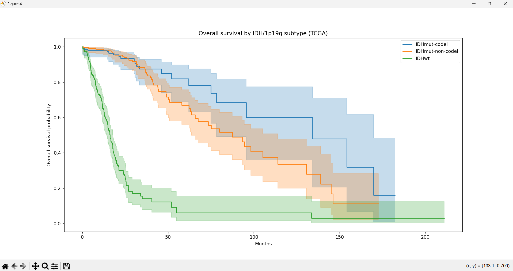

# Pan-Glioma IDH and 1p/19q Codeletion Survival Stratification (TCGA)
## Objective
To assess how molecular subtype (IDH status and 1p/19q codeletion) stratifies overall survival across adult diffuse glioma, combining low-grade glioma (LGG) and glioblastoma (GBM) cohorts from The Cancer Genome Atlas (TCGA).

## Data
Source: cBioPortal, TCGA PanCancer Atlas 2018 clinical patient files for LGG (lgg_tcga_pan_can_atlas_2018) and GBM (gbm_tcga_pan_can_atlas_2018).
- Only patients in the PanCancer Pathways freeze (IN_PANCANPATHWAYS_FREEZE == Yes) were kept.
- Patients missing overall survival time or status were excluded.
- The data are not included in this repository. Download the two cohorts from cBioPortal and set the file paths at the top of Code.py.

## Methodology
- Cleaning: removed administrative and unused columns; converted survival status fields (OS, DSS, PFS) to binary event indicators (1 = event, 0 = censored).
- Subtype assignment: extracted molecular subtype from the TCGA SUBTYPE field into three groups: IDH-wildtype (IDHwt), IDH-mutant with 1p/19q codeletion (IDHmut-codel), and IDH-mutant without codeletion (IDHmut-non-codel). GBM samples labelled GBM were assigned IDHwt.
- Cohort: LGG and GBM cohorts were concatenated into one pan-glioma dataset.
- Survival analysis (lifelines):
- Kaplan-Meier estimation of overall survival
- Pairwise log-rank tests between molecular subtype groups
- Cox proportional hazards regression of overall survival on age and IDH/1p19q group (IDHmut-codel as reference)

## Results
Cox proportional hazards model (n = 607 patients, 195 deaths, 412 censored; reference group: IDHmut-codel)
| Covariate | Hazard ratio | 95% CI | p |
|---|---|---|---|
| Age (per year) | 1.05 | 1.04 to 1.06 | <0.005 |
| IDHmut-non-codel (vs IDHmut-codel) | 2.23 | 1.34 to 3.72 | <0.005 |
| IDHwt (vs IDHmut-codel) | 10.06 | 6.16 to 16.43 | <0.005 |
- Concordance index: 0.86
- Likelihood ratio test: 281.89 on 3 df (p < 0.005)
- Compared with IDH-mutant 1p/19q-codeleted tumours, risk of death was about 2-fold higher for IDH-mutant non-codeleted tumours and about 10-fold higher for IDH-wildtype tumours, after adjusting for age.

Kaplan-Meier and log-rank results
| Group | N | Events | Median OS (months) |
|---|---|---|---|
| IDHmut-codel | 167 | 21 | 134.3 |
| IDHmut-non-codel | 252 | 54 | 87.5 |
| IDHwt | 188 | 120 | 16.1 |
- Pairwise log-rank p-values:
- IDHmut-codel vs IDHmut-non-codel: p = 0.073
- IDHmut-codel vs IDHwt: p = 3.0e-33
- IDHmut-non-codel vs IDHwt: p = 3.1e-44
- The codel vs non-codel difference was not significant in the unadjusted log-rank test but was in the age-adjusted Cox model (HR 2.23), so age may confound the unadjusted comparison.
- Figures: see /Figures
# Example:

## Limitations
- LGG and GBM are pooled, so IDH-wildtype is dominated by GBM and molecular subtype is confounded with tumour grade and histology.
- The Cox model adjusts for age only.
- The proportional hazards assumption was tested with Schoenfeld residuals. Age (p = 0.37 rank-transformed, 0.87 KM-transformed) and the IDHmut-non-codel indicator (p = 0.37, 0.63) showed no violation. The IDHwt indicator showed significance with KM-transformed time (p = 0.032) but not with rank-transformed time (p = 0.29). Its hazard ratio should therefore be read as an average effect over follow-up rather than a constant one.
- Retrospective TCGA data with limited treatment and follow-up information.

## Requirements
- Python 3
- pandas
- matplotlib
- lifelines

